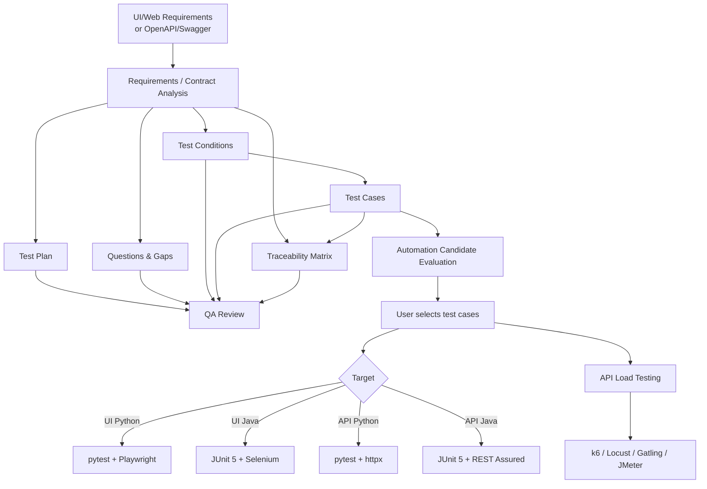

# AI QA Agent — Public Demo

AI QA Agent — pet-проект для автоматизации части QA-процесса с использованием LLM.

Проект принимает требования к UI/Web или OpenAPI/Swagger-спецификацию, анализирует исходные данные и формирует набор QA-артефактов. После этого тестировщик может выбрать конкретные test cases для автоматизации и получить проект автотестов на Python или Java.

> Это публичная демонстрационная версия репозитория. Основной исходный код, внутренние промпты и рабочая реализация хранятся в private repository.

## Что умеет проект

### UI / Web

Входные данные:

- TXT
- Markdown
- DOCX
- PDF

Формируемые артефакты:

- Requirements Analysis
- Test Plan
- Questions / Gaps
- Test Conditions
- Traceability Matrix
- Test Cases
- QA Review

### API

Входные данные:

- OpenAPI 3.x
- Swagger 2.0
- JSON / YAML

Агент анализирует:

- endpoints;
- HTTP methods;
- path/query/header parameters;
- request body;
- response schemas;
- required/optional fields;
- enum/min/max/nullable;
- status codes;
- authentication and authorization;
- negative and boundary scenarios;
- dependencies between API operations.

Формируемые артефакты:

- API Analysis
- API Test Plan
- API Questions
- API Test Conditions
- API Traceability Matrix
- API Test Cases
- API QA Review

## Автоматизация test cases

После формирования test cases агент оценивает их как кандидатов на автоматизацию:

- **Recommended** — хороший кандидат;
- **Optional** — автоматизация возможна, но выгода средняя;
- **Manual** — рациональнее оставить ручным.

Окончательное решение принимает тестировщик.

Пользователь выбирает конкретные кейсы и стек.

### UI automation

**Python**

- pytest
- Playwright
- Allure

**Java**

- JUnit 5
- Selenium
- Allure

### API automation

**Python**

- pytest
- httpx
- jsonschema
- Allure

**Java**

- JUnit 5
- REST Assured
- Jackson
- AssertJ
- Allure

## Нагрузочное тестирование API

Проект также поддерживает генерацию заготовок нагрузочных тестов:

- k6
- Locust
- Gatling
- JMeter

Профили:

- Smoke
- Load
- Stress
- Spike
- Soak

Параметры нагрузки задаются пользователем: virtual users, duration, target RPS.

Для защиты от случайного запуска нагрузочные тесты должны использовать:

- `BASE_URL` через environment variable;
- явный флаг `ALLOW_LOAD_TESTS=true`.

## Архитектура



Подробнее: [docs/architecture.md](docs/architecture.md)

## Traceability

Одна из ключевых идей проекта — сохранять связь между исходным требованием и автоматизированной проверкой:

```text
Requirement
    ↓
Test Condition
    ↓
Manual Test Case
    ↓
Selected for automation
    ↓
Automated Test
```

Идентификаторы требований сохраняются для трассировки, но в документах используются человекочитаемые названия.

Пример:

```text
FAQ: раскрытие и закрытие ответа (V1-F-08)
```

вместо:

```text
V1-F-08
```

## Примеры

### UI / Web

Пример артефактов:

- [Requirements Analysis](examples/ui/requirements_analysis.md)
- [Test Plan](examples/ui/test_plan.md)
- [Test Conditions](examples/ui/test_conditions.md)
- [Traceability Matrix](examples/ui/traceability_matrix.md)
- [Test Cases](examples/ui/test_cases.md)
- [QA Review](examples/ui/qa_review.md)

### API

- [Sample OpenAPI](examples/api/example_openapi.yaml)
- [API Analysis](examples/api/api_analysis.md)
- [API Test Conditions](examples/api/api_test_conditions.md)
- [API Traceability Matrix](examples/api/api_traceability.md)
- [API Test Cases](examples/api/api_test_cases.md)

## Скриншоты

Скриншоты актуальной версии интерфейса будут размещены в:

`docs/screenshots/`

Рекомендуемый набор для публичного README:

1. Главный экран с выбором UI / API.
2. Сформированный пакет QA-артефактов.
3. Окно выбора test cases для автоматизации.
4. Выбор Python / Java.
5. API-режим с OpenAPI/Swagger.
6. Окно генерации нагрузочных тестов.
7. Папка с готовым automation project.

См. [docs/screenshots/README.md](docs/screenshots/README.md).

## Что не публикуется

В public demo отсутствуют:

- рабочие API keys;
- `.env`;
- внутренние LLM prompts;
- основной исходный код;
- служебные механизмы retry/checkpoint;
- приватные тестовые данные;
- реальные production endpoints и credentials.

Полная реализация хранится в private repository.

## Цель проекта

Проект создавался как практическая реализация AI-assisted QA workflow: от анализа требований и тест-дизайна до выбора кандидатов на автоматизацию и генерации проектов автотестов.

Основной принцип: **LLM не заменяет решение тестировщика**. Агент предлагает структуру, анализ, тесты и кандидатов на автоматизацию, но критические решения остаются за QA-инженером.
